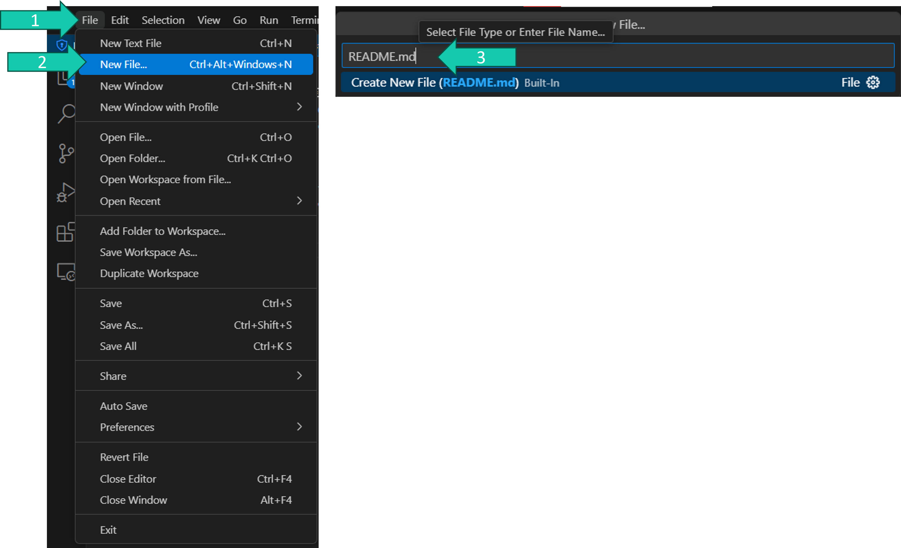
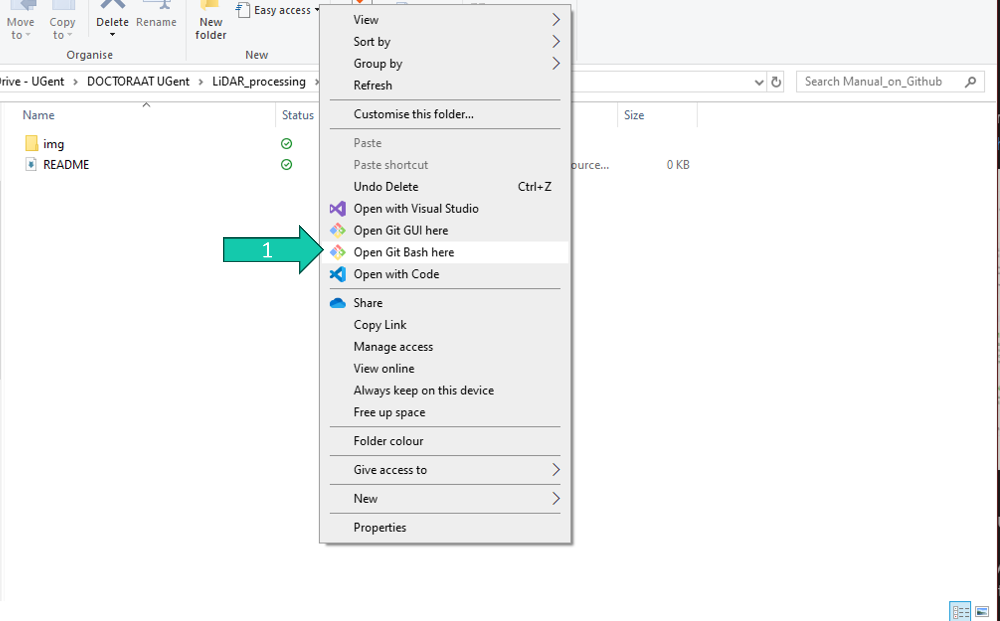
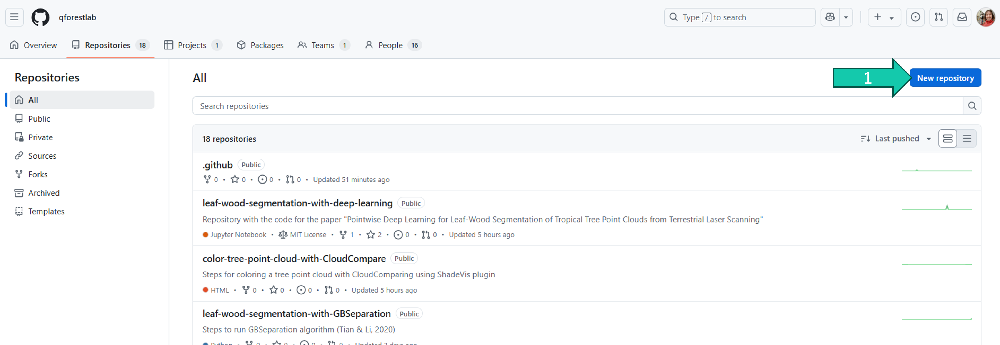
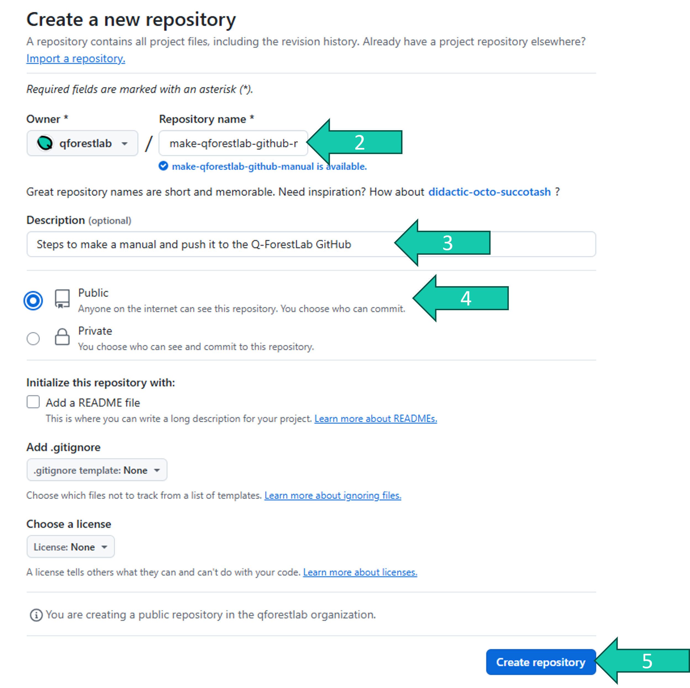
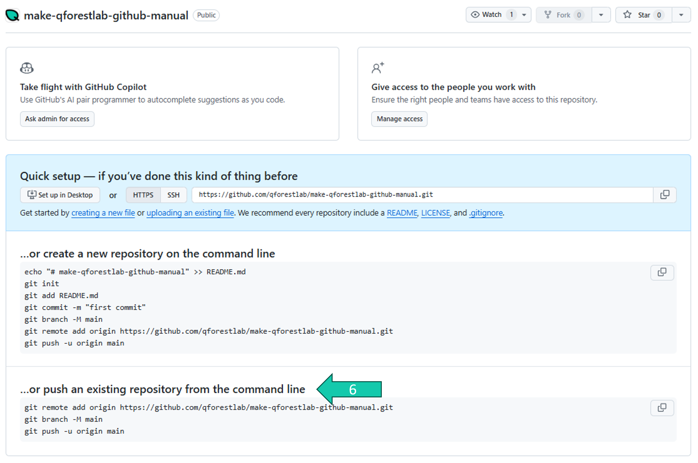

# How to put your manual on Github
If you want to put a manual on the Q-ForestLab GitHub follow the steps explained in this manual.

## Steps
### Prepare your manual
Have all of your manual files/folders in one main folder. Look at the manuals that are already on the GitHub to see examples of good folder structures.

Make sure that within this folder there is a **README.md** file with the explanation of your manual. You can make this file easily in a text editor such as Visual Studio Code:
1. Open Visual Studio Code and go to *File*.
2. Click on *New File...*.
3. Type *README.md* and press enter.
4. Save this file in your main manual folder.



5. Within this README file you provide information on the manual. If you're not used to writing ".md" files, this [cheat sheet](https://gist.github.com/sandrabosk/d79bd806c8b1b13ad9af1e590a26deb5) might help:


### Make a git repo of your manual
Make sure you have installed Git on your pc and that you have a GitHub account which is linked to the [Q-ForestLab GitHub](https://github.com/qforestlab) (ask Wout(er) to add your GitHub account to the Q-ForestLab GitHub if this is not the case).

1. Open Git Bash in your manual folder. You can do this by navigating to your manual folder in file explorer, right-clicking, and clicking on *Open Git Bash here*.


2. type ```git init``` to initate a git repo in this folder.
3. type ```git add --all``` to stage all changes in your working directory for the next commit.
4. type ```git commit -m "First commit"``` to commit all the files.

### Make a new GitHub repo on the Q-ForestLab GitHub
1. Go to the Q-ForestLab GitHub while logged into your own GitHub and navigate to repositories and click on *New repository*.



2. Choose a good name for your manual. Preferrably use the same style as previous manuals with all lower case letters and "-" in between the words.
3. Write a short description of your manual.
4. Put the repo *Public* (or Private if there is a reason for it).
5. Click *Create repository*.



6. Now you copy the code under "…or push an existing repository from the command line" and run it in Git Bash to push your repo to GitHub.



Your local repo is now linked to a repo on the Q-ForestLab GitHub.

### Make changes to the manual
When you make changes to the manual locally you will have to stage, commit and push them to the GitHub repo to see the changes online:

In Git Bash:

4. type ```git add --all``` to stage all changes in your working directory for the next commit.
5. type ```git commit -m "message about your commit"``` to commit all the staged changes.
6. type ```git push -u origin main``` to push the commit to the GitHub repo.

## Git and GitHub tutorials
For more info check out some git and GitHub tutorials online.

Github has really nice tutorials to try out yourself, for example: https://docs.github.com/en/get-started/start-your-journey/hello-world. If you really want to get familiar with how the git system works, [here](https://learngitbranching.js.org/) is an interactive tutorial to learn the commands, or a [full free game](https://ohmygit.org/) using git commands.


